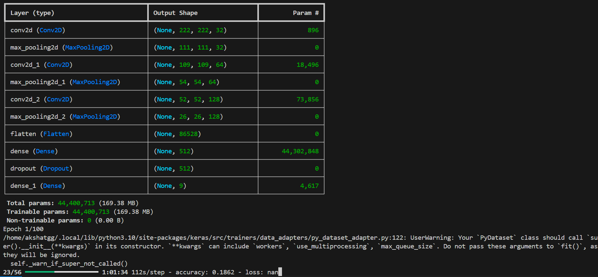

# Skin Cancer Classification Using Deep Learning

## Table of Contents
- [Project Overview](#project-overview)
- [Features](#features)
- [Technologies Used](#technologies-used)
- [Dataset](#dataset)
- [Installation](#installation)
- [Usage](#usage)
- [Model Training](#model-training)
- [Results](#results)
- [Contributing](#contributing)
- [License](#license)
- [Acknowledgements](#acknowledgements)

## Project Overview
This project aims to develop a deep learning model to classify skin cancer images using Convolutional Neural Networks (CNNs). Leveraging the ISIC (International Skin Imaging Collaboration) dataset, the model predicts the likelihood of various types of skin lesions, thus assisting healthcare professionals in diagnostics.

## Features
- **Image Classification**: Classifies skin lesions into nine categories.
- **Data Augmentation**: Improves model robustness through various transformations.
- **Model Evaluation**: Provides performance metrics such as accuracy, precision, recall, and F1-score.
- **Visualization**: Displays training and validation loss/accuracy graphs.

## Technologies Used
- Python
- TensorFlow/Keras
- OpenCV
- NumPy
- Matplotlib
- Scikit-learn

## Dataset
The model is trained on the ISIC dataset, which consists of labeled images of skin lesions across **nine classes**:
1. **Actinic Keratosis**
2. **Basal Cell Carcinoma**
3. **Dermatofibroma**
4. **Melanoma**
5. **Nevus**
6. **Pigmented Benign Keratosis**
7. **Seborrheic Keratosis**
8. **Squamous Cell Carcinoma**
9. **Vascular Lesion**

The dataset is structured as follows:

```
dataset/
    ├── train/
    │   ├── actinic_keratosis/
    │   ├── basal_cell_carcinoma/
    │   ├── dermatofibroma/
    │   ├── melanoma/
    │   ├── nevus/
    │   ├── pigmented_benign_keratosis/
    │   ├── seborrheic_keratosis/
    │   ├── squamous_cell_carcinoma/
    │   └── vascular_lesion/
    └── test/
        ├── actinic_keratosis/
        ├── basal_cell_carcinoma/
        ├── dermatofibroma/
        ├── melanoma/
        ├── nevus/
        ├── pigmented_benign_keratosis/
        ├── seborrheic_keratosis/
        ├── squamous_cell_carcinoma/
        └── vascular_lesion/
```

The images in each folder correspond to their respective skin lesion type.

## Installation
Follow the steps below to set up the project locally:

1. **Clone the repository**:
   ```bash
   git clone https://github.com/yourusername/skin-cancer-classification.git
   cd skin-cancer-classification
   ```

2. **Install required packages**:
   You can create a virtual environment and install the dependencies listed in `requirements.txt`:
   ```bash
   pip install -r requirements.txt
   ```

## Usage
1. **Prepare the dataset**: Ensure your dataset is structured as shown in the Dataset section.

2. **Run the training script**:
   ```bash
   python3 pipeline.py
   ```


## Model Training
The model is trained using the following parameters:
- **Epochs**: 100
- **Batch Size**: 32
- **Optimizer**: Adam
- **Loss Function**: Categorical Crossentropy

### Example Training Code
```python
history = model.fit(train_data, 
                    epochs=100, 
                    validation_data=test_data)
```

## Results
Upon completion of the training, the model's performance metrics will be displayed, including accuracy and loss graphs. These can be visualized using Matplotlib.

### Sample Output


## Contributing
Contributions are welcome! If you'd like to contribute to this project, please fork the repository and create a pull request. You can also report issues or suggest features.

## License
This project is licensed under the MIT License. See the [LICENSE](LICENSE) file for more details.

## Acknowledgements
- [ISIC Archive](https://www.isic-archive.com/) for providing the dataset.
- TensorFlow and Keras for their powerful deep learning frameworks.
- [OpenCV](https://opencv.org/) for image processing capabilities.
